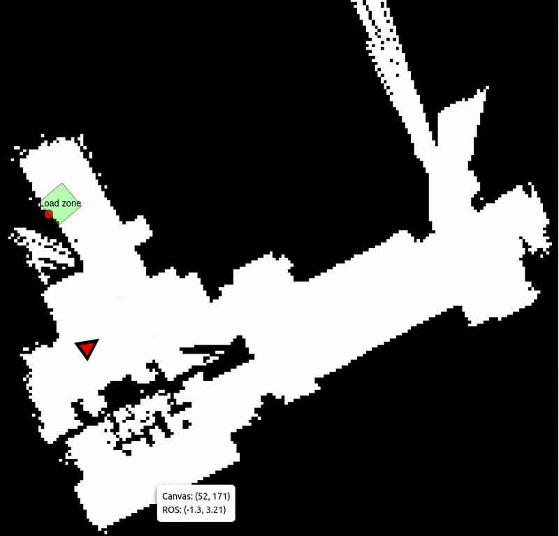
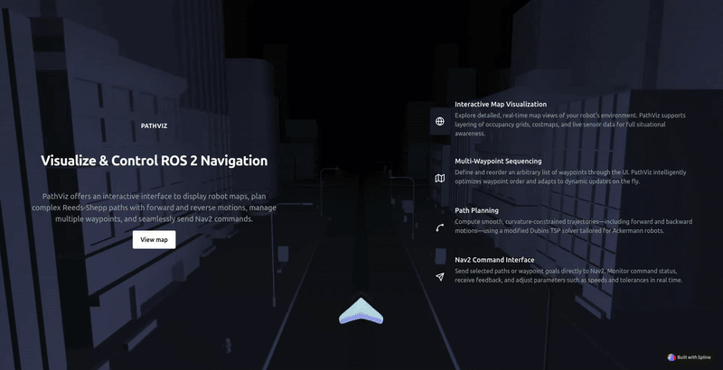

# ROS2 Web Interface for Navigation and Visualization

This project provides a powerful and intuitive web interface for visualizing ROS2 data in real-time. It is designed to assist in robot monitoring, route planning, and remote control, especially for robots with Ackermann steering constraints.

## Features

### Real-Time Map Visualization

- Renders a dynamic map using a canvas interface.
- Displays the robot’s current position in real-time.
- Overlays custom signs and markers detected by the robot (e.g., objects, landmarks, or vision-based tags).

### Interactive Point Selection and Route Planning

- Allows users to select multiple points directly on the map.
- Computes an optimized route through the selected points using a **Traveling Salesman Problem (TSP)** solver.
- The solver is aware of **Ackermann steering constraints**, ensuring feasible paths for differential and car-like robots.

### Navigation Integration

- Sends the optimized path as a list of waypoints to the **Nav2 Simple Navigator**, allowing autonomous execution of complex missions.

### WebRTC Live Streaming

- Streams live video from the robot to the web interface using **WebRTC**, enabling remote monitoring and telepresence.

